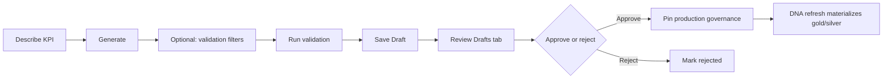

# KPI Generator (portal)

Natural-language KPI drafting in the client portal. Bedrock drafts Athena SQL using Source Browser gold YAML and the production DNA pack as context. **Approved SQL is pinned under governance semver and replayed verbatim** on scheduled refreshes — AI is not invoked again after approval.

**Portal route:** `/portal/dna/kpi-generator` (admin only)

**Code:** `packages/meshflow-portal/src/meshflow/dna/web/portal/kpi_generator/`

---

## Portal tabs

| Tab | Purpose |
|---|---|
| **KPI Generator** | Describe a KPI, run session validation filters, save as a DNA draft |
| **Review Drafts (N)** | List pending drafts, approve or reject individually or in bulk |

The Review Drafts tab shows a count of proposals awaiting review (`pending_review`).

---

## Operator workflow



### 1. Generate

On the **KPI Generator** tab, send a natural-language request. Bedrock returns a structured draft:

- Layer (`silver` or `gold`), mode, transform id
- Target entity or output id
- Fields, filters, calculation summary
- Athena `SELECT` SQL

The proposal is stored as a **working** session artifact (not yet a governance version).

### 2. Validate (optional)

Use **Validation criteria** to add session-only filters (fact, field, value). **Run validation** executes the SQL in Athena with those predicates wrapped around the query. Validation does **not** change the pinned SQL; it is for spot-checking one invoice, customer, etc.

Filters apply only to the validation run unless the same logic is included in the generated SQL itself.

### 3. Save Draft

**Save Draft** on the proposed calculation card:

- Bumps a new **patch** governance version from the current production pin
- Writes DNA pack at that version with `status: draft`
- Writes SQL pack manifest + exact `.sql` files under that version
- Copies reporting sidecar forward at the same version (when present)
- Appends workflow history (does **not** change `active_version`)
- Moves the proposal to `pending_review` and stores a full `governance_snapshot` (prompt, draft, validation, SQL)

Production portal and scheduled jobs continue to use the **previous** pinned version until a draft is approved.

### 4. Review Drafts

Open **Review Drafts**. Each row shows:

- Transform id, layer, mode, target, governance version (collapsed summary)
- **Approve** / **Reject** on the summary row (not inside the expanded panel)

Expand a row to see the original request, calculation, validation output, and formatted SQL.

**Approve all** / **Reject all** act on every pending draft in one action.

### 5. Approve

**Approve** on a pending draft:

- Promotes the draft governance version to `status: production`
- Pins `workflow.active_version` (and reporting pin when applicable)
- Marks the proposal `approved`

Scheduled DNA refresh then materializes gold (or silver column-add SQL on connector refresh) using the pinned SQL **verbatim** (checksum verified).

### 6. Reject

**Reject** marks the proposal `rejected`. Production pins are unchanged. The draft version remains in governance history as a draft; it is not promoted.

---

## Proposal statuses

| Status | Meaning |
|---|---|
| `working` | Generated on the KPI Generator tab; not saved to governance |
| `pending_review` | Saved as a DNA draft; listed on Review Drafts |
| `approved` | Promoted to production and pinned |
| `rejected` | Rejected from Review Drafts; not pinned |

---

## Layer rules (SQL packs)

| Change | Layer | SQL path | Runs when |
|---|---|---|---|
| Column adds on an existing silver entity | `silver` | `sql/silver/*.sql`, mode `add_columns` | After silver consolidate (connector refresh) |
| New fact table or KPI output | `gold` | `sql/gold/*.sql`, mode `fact_table` or `kpi` | DNA refresh |

Athena SQL should reference Glue table names **without** a database prefix, e.g. `silver_dbc_sales_invoice_lines`, `dna_out_executive_kpis`. The portal normalizes common `silver.` / `gold.` qualifiers before validation.

See also [architecture.md](./architecture.md) (lake layout and layer contract).

---

## Artifacts

**Working / review proposals** (full generator context):

```text
governance/{company}_dna_config/kpi_generator/proposals/{proposal_id}.json
```

**Governance version** (on Save Draft or Approve):

```text
governance/{company}_dna_config/v{semver}/{company}_dna_config.yaml
governance/{company}_dna_config/v{semver}/sql/manifest.yaml
governance/{company}_dna_config/v{semver}/sql/silver/*.sql
governance/{company}_dna_config/v{semver}/sql/gold/*.sql
governance/{company}_dna_config/workflow.json
```

Proposal JSON retains prompt, draft, `last_validation`, `governance_version`, and `governance_snapshot` after save.

---

## Related portal surfaces

| Surface | Role |
|---|---|
| **Source Browser** | Gold YAML reference (`entity_properties`, relationships, tags) reconciled with `latest_profile.yaml` from silver ETL |
| **Pack Registry** (`/portal/governance`) | Version history for all governance saves, including KPI Generator drafts and approvals |

Silver consolidate writes `governance/source_semantic_reference/{source}/latest_profile.yaml`; the source-docs gold job enriches all three gold artifacts with `silver_column`, `in_silver`, and `origin` (relationships also get `silver_FK` / `silver_PK`).

---

## Manual gold refresh

Admins can trigger a DNA Step Functions refresh from the **Gold refresh** card on the KPI Generator page (publish-only: SQL pack replay, else compile fallback). Monthly quota is tracked per client (`dna_manual_refresh` in portal config).

---

## Implementation notes

- **Bedrock budget** shares the portal Config Assist monthly allowance meter.
- **Validation** uses the reporting UI Lambda role (Athena + Glue read on the tenant catalog).
- **Approve** reuses the same persistence path as the former direct “pin SQL” action, but only after explicit review of a saved draft (or approve from Review Drafts for a `pending_review` proposal at its draft version).
